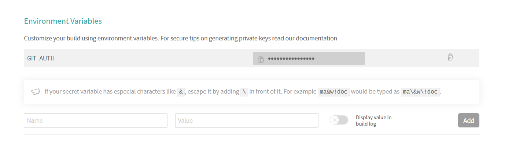

| Travis CI                                             |
|-------------------------------------------------------|
| [![Build Status][travis-badge]][travis-url]           |

| Build History                                         |
|-------------------------------------------------------|
| [![Travis build history][travis-history]][travis-url] |

[travis-url]: https://travis-ci.org/HSLU-BaumannWicki/BA-Dokumentation-Template
[travis-badge]: https://travis-ci.org/HSLU-BaumannWicki/BA-Dokumentation-Template.svg?branch=master
[travis-history]: https://buildstats.info/travisci/chart/HSLU-BaumannWicki/BA-Dokumentation-Template?branch=master&includeBuildsFromPullRequest=false

# Bachelorarbeit Dokumentation Vorlage
In diesem Repository ist eine LaTeX Vorlage für eine Bachelorarbeit, die Arbeit ist nach der "Vorlage & Formulare\AufbauDokumentation" auf dem SharePoint Ordner I_Projektschiene der HSLU strukturiert.
Die einzelnen Kapitel sind in separate TeX-Dateien im Ordner include ausgelagert und werden über den Befehl ```\include{Datei.tex}``` in das Hauptdokument eingebunden.

Die Ordnerstruktur ist die folgende:

```text
Hauptordner
	|- appendix				Alle Dokumente für den Anhang (PDFs in diesem Ordner werden durch das .gitignore nicht erfasst)
	|- img					Alle Bilder (werden durch den \graphicspath im Hauptdokument gefunden)
	|- include				Alle Kapitel-Dateien welche in das Hauptdokument eingebunden werden (inklusive Präambel)
	|- .gitignore
	|- .travis.yml				Konfigurationsdatei für Travis
	|- .version				Hilfsdatei für die Versionierung für das CD über Travis
	|- BA-Dokumentation-Template.tex	Hauptdatei
	|- Referenzen.bib			BibTeX Datei / Referenzbibliothek
	|- texlive.profile			Hilfsdatei für das Installskript
	|_ texlive_install.sh			Installskript
```

# Travis CI/CD
Jeder commit wird über Travis gebaut und bei einer Änderung auf dem Master direkt als "Pre-Release" deployed. Dafür muss [Travis-CI.org](https://travis-ci.org/) oder [Travis-CI.com](https://travis-ci.com) zuerst die diesbezüglichen Berechtigungen erhalten, und für dieses Repo aktiviert sein. Danach muss der Dateiname in ```travis.yml``` nachgetragen werden. Damit das Deployment funktioniert muss ein OAuth Token generiert werden und in Travis hinterlegt werden.

## Versionierung
Unsere Versionierung folgt dem Schema ```v.(Major).(Minor).(Commitnummer - Automatisch)```, dies aus dem Grund damit die Version sicher immer automatisch inkrementiert wird, und keine identischen Versionsnummern für verschiedene Dokumente existieren können. Major und Minor sind in der Datei ```.version``` spezifiziert, während Travis die Buildnummer automatisch einfügt.

## Anpassungen in .travis.yml
Ändere den Name von ```FILE_NAME``` auf dein Dokument:

```yaml
env:
  - FILE_NAME=NAME-DEINES-DOKUMENTS
```

## Warum die vielen ```tlmgr install```?
In einer ersten Version installierten wir die ganze TeXLive Suite für jeden Build. Dies hat jeweils um die zehn Minuten gedauert. Im Vergleich dazu lief der Build der Datei jeweils maximal eine Minute. Diese Diskrepanz wollten wir angehen. Daher installieren wir eine minimale Umgebung über das Installierskript ```texlive_install.sh```. Damit aber unser Build nicht failt, müssen wir alle fehlenden Packete (und deren Abhängigkeiten) nachinstallieren. Und dazu kommt noch, dass wir die LaTeX-Build Fähigkeit auf Travis hinaufsetzen, da TeX/LaTeX nicht offiziell unterstützt wird.

### Fehlerbehebung
Am einfachsten sucht man im ```tlmgr``` Repository nach der fehlenden Datei/Packet und fügt danach das fehlende Packet zur ```tlmgr install``` Linie im Skript.

```bash
tlmgr search --global -all <filename here>*
```
```yaml
...
install:
  - 
  [...]
  - tlmgr install [...] new_package
...
```

## OAuth Token in Environment Variable in Travis
Generiere über die [Anleitung von Github](https://help.github.com/en/articles/creating-a-personal-access-token-for-the-command-line) ein OAuth Token für dein Konto mit den Berechtigungen ```repo``` oder nur ```public_repo```. Danach kopierst du den erhaltenen Hash in eine Environment Variable namens ```GIT_AUTH``` in den Einstellungen von Travis für dein jeweiliges Repo.



# PDF/A Compliance
Das Reglement der HSLU für Wirtschafts- und Bachelorarbeiten verlangt für die Abgabe von WebAbstract und Dokumentation die Einhaltung des [PDF/A-Dateiformats](http://www.pdfa.org/). Wir erreich dies über das Packet ```pdfx``` und legen über ```\usepackage[a-2b,latxmp]{pdfx}``` sowohl den Standard (2A Basic) und eine externe Metadatendatei fest. Damit wird unser Dokument direkt in ein PDF/A2b-PDF kompiliert.

## <Dateiname>.xmpdata
Erstens ist es wichtig, dass die ```.xmpdata```-Datei genau gleich heisst wie die ```.tex```-Datei, da sie ansonsten von ```pdfx``` nicht erkannt wird. Zweitens verwenden wir nur ein Subset der verfügbaren Befehle für ```pdfx```, genauere Details sind in der [Dokumentation auf CTAN](https://www.ctan.org/pkg/pdfx) zu finden. Wichtig ist, dass Werte in gewissen Feldern (zum Beispiel die Autoren oder Keywords) mit einem speziellen Separator ```\sep``` getrennt werden können. Ein Beispiel:

```xml
...
\Author{AUTOR01\sep AUTOR02}
\Title{TITEL}
...
```

## Was hat es mit "the glyph width information" in veraPDF auf sich
Kurzgesagt (unsere Hypothese): Die Schriftart die wir benutzen hat Sonderzeichen welche eine Breite von 0 angeben, was nicht akzeptiert ist.
Es gibt nun zwei Arten mit diesem Fehler umzugehen:
1. Ignorieren, da das generierte PDF dennoch als PDF/A im gängigen Acrobat Reader erkannt wird
2. Eine andere Schriftart verwenden (zum Beispiel die standardmässige von KomaScript verwendete)

# Schlusswort
Wir hoffen unsere Vorlage nimmt euch ein Bisschen Arbeit ab, damit ihr euch auf die Arbeit konzentrieren könnt. Viel Erfolg!
Pascal & Dane
